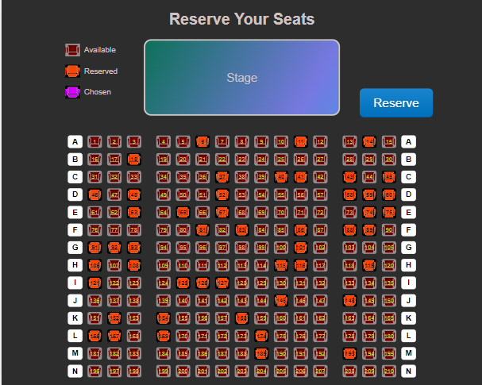
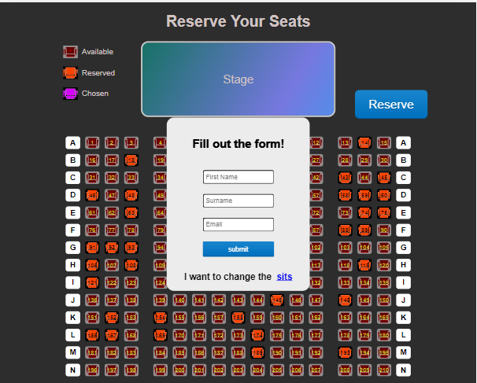
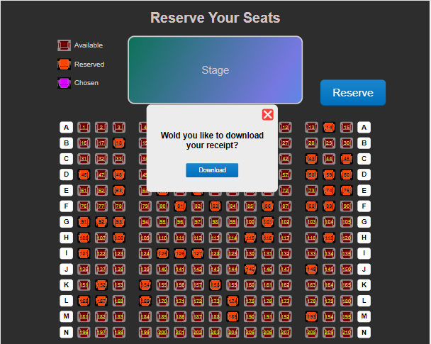

# Animation with Vannila JS

## Table of contents

- [Description](#Description)
- [Screenshot](#screenshot)
- [Links](#links)
- [Built with](#built-with)
- [Author](#author)

## Users should be able to:

</br>

- Reserve seats.

- Change seats before filling out the form.

- Fill out a form with their data.

- Download a receipt with their data and the seats chosen.
  </br>

### Screenshots

</br>
<p align="center">
    
</p>
</br>
</br>
<p align="center">
    
</p>
</br>
</br>
<p align="center">
    
</p>
</br>

### Links

- Live Site URL: [thiagoando.github](https://thiagoando.github.io/Features-Galore/)

### Built with

- Semantic HTML5 markup
- CSS custom properties
- Java Script

### Description

This Seat Reservation program was built using JS best practices. This web page is made mostly using JS code. On this web page, the user can reserve one or more seats if they are not already reserved. the program will simulate different random seats each time the page is refreshed. They can choose and unchoose the seats. After picking a seat, they have to fill out the form that will take their data to generate a receipt and mark the chosen seat as reserved.
The idea for this program belongs to [William Mead](https://www.coursera.org/instructor/wmmead). You can check his solution on
[Data Manipulation in JavaScript](https://www.coursera.org/learn/javascript-data-manipulation?specialization=javascript-beginner). However, you won't see the same code as you find in this repository. I developed the program using my code and a few ideas.

You can check the code used to make it below:
##HTML

```html
<!DOCTYPE html>
<html>
  <head>
    <meta charset="UTF-8" />
    <title>Seat Reservations</title>
    <meta name="description" content="Reserve your seat" />
    <meta name="Thiago" content="Cinema Seats Reservation" />
    <link rel="icon" href="./svg/chair-a.svg" />

    <link href="styles.css" rel="stylesheet" />
    <script src="https://cdnjs.cloudflare.com/ajax/libs/jspdf/1.0.272/jspdf.debug.js"></script>
    <script src="script.js"></script>
  </head>

  <body>
    <h1>Reserve Your Seats</h1>

    <div id="stage">Stage</div>
    <div id="eg">
      <ul>
        <li></li>
        <li></li>
        <li></li>
      </ul>
      <div>
        <p>Available</p>
        <p>Reserved</p>
        <p>Chosen</p>
      </div>
    </div>

    <div id="formContainer">
      <h2>Fill out the form!</h2>
      <form id="resform">
        <input
          type="text"
          id="Fname"
          name="Fname"
          placeholder="First Name"
          required
        />
        <input
          type="text"
          id="Sname"
          name="Sname"
          placeholder="Surname"
          required
        />
        <input
          type="email"
          id="email"
          name="email"
          placeholder="Email"
          required
        />
        <button id="confirmbtn">submit</button>
      </form>
      <h3>I want to change the &nbsp;<a href="#">sits</a></h3>
    </div>
    <div id="seating">
      <section id="left"></section>

      <section id="middsile"></section>

      <section id="right"></section>
    </div>
    <button id="Mreserve">Reserve</button>

    <div id="print">
      <h3>Wold you like to download your receipt?</h3>
      <div></div>
      <button>Download</button>
    </div>
    <div id="block"></div>
  </body>
</html>
```

##CSS

```css
* {
  box-sizing: border-box;
}

body {
  font-family: Arial;
  background-color: rgba(0, 0, 0, 0.822);
  color: rgb(209, 195, 195);
}

h1,
h2 {
  text-align: center;
}

h2 {
  margin-top: 40px;
  text-shadow: black 1px 0px 0px;
}

#stage {
  width: 400px;
  margin: auto;
  line-height: 150px;
  border: 3px solid #ccc;
  border-radius: 15px;
  text-align: center;
  font-size: 24px;
  margin-bottom: 40px;
  background: linear-gradient(300deg, #00bfff, #7678df, #04704c);
  background-size: 180% 180%;
  animation: gradient-animation 8s ease infinite;
}

@keyframes gradient-animation {
  0% {
    background-position: 0% 50%;
  }
  50% {
    background-position: 100% 50%;
  }
  100% {
    background-position: 0% 50%;
  }
}

#seating {
  overflow: hidden;
  width: 730px;
  margin: auto;
  padding-left: 10px;
}

#seating section {
  float: left;
}

#seating section div {
  float: left;
  margin-right: 10px;
  margin-bottom: 10px;
  width: 30px;
  line-height: 26px;
  border-radius: 5px;
  text-align: center;
  font-size: 10px;
  background-color: #948f8f;
  background-image: url("./svg/chair-a.svg");
  background-repeat: no-repeat;
  background-position: center;
  color: rgb(206, 206, 47);
}

#eg {
  position: absolute;
  top: 80px;
  left: 130px;
  display: inline-flex;
  height: 130px;
}

#eg div {
  margin-left: 8px;
  display: flex;
  justify-content: space-around;
  flex-direction: column;
  display: inline-flex;
}
#eg div p {
  font-size: 16px;
  font-weight: 500;
  text-align: start;
}

ul {
  display: flex;
  flex-direction: column;
  justify-content: space-around;
  margin: 0;
  padding: 0;
  list-style: none;
}

ul li {
  margin: 0;
  padding: 0;
  height: 26px;
  width: 30px;
}

ul li:first-of-type {
  background-color: #948f8f;
  background-image: url("./svg/chair-a.svg");
  background-position: center;
}

ul li:nth-child(2) {
  background-color: black;
  background-image: url("./svg/chair-r.svg");
  background-position: center;
}

ul li:last-of-type {
  background-color: black;
  background-image: url("./svg/chair-s.svg");
  background-position: center;
}

p {
  margin: 0;
  font-size: 12px;
}

#seating section .seats:hover {
  background-color: black;
  background-image: url("./svg/chair-h.svg");
  cursor: pointer;
}

#seating section .seats p:hover {
  color: black;
  font-weight: 700;
}

#seating section .clicked {
  color: black;
  background-color: black;
  background-image: url("./svg/chair-s.svg");
}
#seating section .reserved {
  color: black;
  background-color: black;
  background-image: url("./svg/chair-r.svg");
}

#seating #right .label {
  float: right;
}

#seating .label {
  background-image: none;
  background-color: white;
  color: black;
  font-weight: 700;
  font-size: 16px;
  text-transform: uppercase;
}

#left,
#right {
  width: 160px;
}

#middsile {
  width: 360px;
  margin: 0 20px;
}

#reserve {
  display: block;
  position: absolute;
  top: 20px;
  left: 20px;
  padding: 20px;
  background: #b7e792;
  text-decoration: none;
}

/****************** Reservation form *****************/

#formContainer {
  position: absolute;
  width: 30vw;
  opacity: 0;
  top: -100%;
  left: 35%;
  color: black;
  background: #ececec;
  border-radius: 15px;
  transition: opacity 0.3s linear;
  z-index: 100;
}

#resform {
  width: 30vw;
  padding: 20px;
  margin-bottom: 0px;
  padding-bottom: 0px;
}

#resform h2,
p {
  text-align: center;
}

#confirmres {
  text-align: center;
}

input {
  display: block;
  width: 15vw;
  margin: auto;
  padding: 5px;
  margin-bottom: 20px;
  border-radius: 5px;
}

#confirmbtn,
button {
  display: block;
  width: 15vw;
  margin: auto;
  margin-bottom: 30px;
  border-radius: 5px;
  padding: 6px 14px 6px;
  font-family: Arial, sans-serif;
  font-size: 14px;
  line-height: 20px;
  color: #ffffff;
  text-align: center;
  text-shadow: 0 1px 1px rgba(0, 0, 0, 0.2);
  text-decoration: none;
  cursor: pointer;
  background-color: #0077c8;
  background-image: -webkit-linear-gradient(
    rgba(255, 255, 255, 0.1) 0%,
    rgba(0, 0, 0, 0.05) 95%
  );
  background-image: -moz-linear-gradient(
    rgba(255, 255, 255, 0.1) 0%,
    rgba(0, 0, 0, 0.05) 95%
  );
  background-image: -linear-gradient(
    rgba(255, 255, 255, 0.1) 0%,
    rgba(0, 0, 0, 0.05) 95%
  );
  background-image: -ms-linear-gradient(
    rgba(255, 255, 255, 0.1) 0%,
    rgba(0, 0, 0, 0.05) 95%
  );
  background-repeat: repeat-x;
  border: 0;
  -webkit-border-radius: 3px;
  -moz-border-radius: 3px;
  border-radius: 3px;
  -webkit-box-shadow: inset 0 -2px 0 rgba(0, 0, 0, 0.2);
  -moz-box-shadow: inset 0 -2px 0 rgba(0, 0, 0, 0.2);
  box-shadow: inset 0 -2px 0 rgba(0, 0, 0, 0.2);
  -webkit-transition: 0.1s;
  -moz-transition: 0.1s;
  transition: 0.1s;
  -webkit-box-sizing: border-box; /* Safari/Chrome, other WebKit */
  -moz-box-sizing: border-box; /* Firefox, other Gecko */
  box-sizing: border-box; /* Opera/IE 8+ */
}

#Mreserve {
  position: fixed;
  top: 150px;
  right: 100px;
  font-size: 25px;
  font-weight: 500;
  height: 60px;
  width: 150px;
  border-radius: 10px;
  margin-top: 30px;
}

#print {
  position: absolute;
  width: 300px;
  height: 200px;
  opacity: 0;
  top: -100px;
  left: 34%;
  color: black;
  background: #ececec;
  border-radius: 10px;
  transition: opacity 0.3s linear;
  text-align: center;
  z-index: 100;
}

#formContainer h3 {
  text-align: center;
}

#print h3 {
  text-shadow: 0 1px 1px rgba(0, 0, 0, 0.2);
  margin: 60px 20px 30px 20px;
}

#print div {
  top: 10px;
  right: 10px;
  width: 26px;
  height: 26px;
  border-radius: 5px;
  position: absolute;
  background-image: url("./svg/icons8-close-window-48.png");
  background-position: center;
}

#print button {
  width: 40%;
}

#block {
  position: absolute;
  left: 0px;
  top: 0px;
  width: 100vw;
  height: 100vw;
  background-color: #ffffff00;
  display: none;
}
```

##JS

```js
window.addEventListener("load", function () {
  const stageL = this.document.getElementById("left");
  const stageR = this.document.getElementById("right");
  const middsile = this.document.getElementById("middsile");
  let seatReserved = [];
  const reserveButton = this.document.querySelector("#Mreserve");
  const forms = document.querySelector("#formContainer");
  let Fname = "";
  let Sname = "";
  let email = "";
  const blockSeats = this.document.getElementById("block");
  const confiBtn = this.document.getElementById("confirmbtn");
  const pScreen = this.document.getElementById("print");
  const download = document.querySelector("#print > button");
  const closeScreen = this.document.querySelector("#print > div");

  let label = [
    "A",
    "B",
    "C",
    "D",
    "E",
    "F",
    "G",
    "H",
    "I",
    "J",
    "K",
    "L",
    "M",
    "N",
  ];

  makeSeats(stageL, 0, 14, 13);
  makeSeats(stageR, 12, 14, 13);
  makeSeats(middsile, 3, 139, 7);

  //Start of making Seats=================================================

  function makeSeats(stage, Fnum, Snum, Tnum) {
    let i = 0;
    let sitNum = [];
    let count2 = 0;
    let count4 = 0;
    let condition1 = false;
    let condition2 = false;
    let condition3 = false;
    function evaluate(y) {
      switch (stage.id) {
        case "middsile":
          condition1 = y < 10;
          condition2 = count2 == 11;
          condition3 = y >= 10 && count2 < 10;

          break;
        default:
          condition1 = i == 0 && count2 < 4;
          condition2 = count2 == 4 && i >= 1;
          condition3 = i >= 1;
      }
    }
    if (stage.id != "middsile") {
      for (i; i < Snum; i++) {
        stage.innerHTML += "<div class='label'>" + `${label[i]}` + "</div>";
        makeSeatsPartTwo(3);
      }
    } else {
      makeSeatsPartTwo(140);
    }
    function makeSeatsPartTwo(num) {
      for (var y = 1; y <= num; y++) {
        count2++;
        evaluate(y);
        if (condition1) {
          stage.innerHTML +=
            "<div id=" +
            `${label[count4]}` +
            "-" +
            `${y + Fnum}` +
            " class = seats>" +
            "<p>" +
            `${y + Fnum}` +
            "</p>" +
            "</div>";
          sitNum.push(y + Fnum);
        }
        evaluate(y);
        if (condition2) {
          sitNum.push(sitNum[sitNum.length - 1] + Tnum);
          count4++;
          count2 = 1;
          stage.innerHTML +=
            "<div id=" +
            `${label[count4]}` +
            "-" +
            `${sitNum[sitNum.length - 1]}` +
            " class = seats><p>" +
            `${sitNum[sitNum.length - 1]}` +
            "</p></div>";
          evaluate(y);
        } else if (condition3) {
          sitNum.push(sitNum[sitNum.length - 1] + 1);
          stage.innerHTML +=
            "<div id=" +
            `${label[count4]}` +
            "-" +
            `${sitNum[sitNum.length - 1]}` +
            " class = seats><p>" +
            `${sitNum[sitNum.length - 1]}` +
            "</p></div>";
        }
      }
    }
  }

  //Start of making random Reserved seats=================================================

  (function () {
    let condition = true;
    let count3 = 0;
    var getSeat = "";
    position = ["#left", "#middsile", "#right"];
    for (var z = 0; z <= 70; z++) {
      if (count3 == 0 || count3 == 2) {
        randonSeat(50, count3);
      } else {
        randonSeat(120, count3);
      }
      count3++;
      if (count3 == 3) {
        count3 = 0;
      }
    }
    function randonSeat(num1, num2) {
      var getSeatNum = Math.round(Math.random() * num1) + 1;
      getSeat = document.querySelector(
        "#seating " +
          `${position[num2]}` +
          " div:nth-child(" +
          `${getSeatNum}` +
          ")"
      );
      condition = getSeat.getAttribute("class") != "label";
      if (condition) {
        getSeat.classList.remove("seats");
        getSeat.classList.add("reserved");
      }
    }
  })();

  //End of making random Reserved seats======================================

  //Start of Reserving Seats=================================================
  let seats = this.document.querySelectorAll(".seats");
  seats.forEach((seat) => {
    seat.addEventListener("click", changeClass);
  });

  function changeClass() {
    if (!this.value) {
      this.className = "clicked";
      this.value = 1;
    } else {
      this.className = "seats";
      this.value = undefined;
    }
  }

  reserveButton.onclick = function () {
    blockSeats.style.display = "block";
    forms.style.top = "30%";
    forms.style.opacity = 100;
    recordSeats();
  };

  function returnClicked() {
    return this.document.querySelectorAll(".clicked");
  }

  function recordSeats() {
    let clickedSeats = returnClicked();
    clickedSeats.forEach((seat) => {
      seatReserved.push(seat.getAttribute("id"));
    });
  }
  // Start of I want to change seats ===============================================
  const changeSit = document.querySelector("#formContainer h3 a");
  changeSit.onclick = (event) => {
    event.preventDefault();
    seatReserved = [];
    forms.style.top = "-100%";
    forms.style.opacity = 0;
    blockSeats.style.display = "none";
    let clickedSeats = returnClicked();
    clickedSeats.forEach((seat) => {
      seat.className = "seat";
    });
  };
  // End of I want to change seats ===============================================

  //Start of colecting data from the form ========================================

  confiBtn.onclick = () => {
    Fname = document.getElementById("Fname").value;
    Sname = document.getElementById("Sname").value;
    email = document.getElementById("email").value;

    document.querySelectorAll("input").forEach((input) => {
      input.value = "";
    });

    if (Fname && Sname && email) {
      forms.style.top = "-100%";
      forms.style.opacity = 0;
      makePerson();
      printScreen();
    }
  };
  //End of colecting data from the form ========================================

  //Start of making a object Person ============================================

  function PersoReservation(name, Surname, emailaddress, seatId) {
    this.Name = name;
    this.SurName = Surname;
    this.Email = emailaddress;
    this.Seat = seatId;
  }

  function makePerson() {
    person1 = new PersoReservation(Fname, Sname, email, seatReserved);
  }

  //End of making a object Person ============================================

  //Start of print receipt screen ============================================

  function printScreen() {
    pScreen.style.top = "30%";
    pScreen.style.opacity = 100;
    let changeToReserved = returnClicked();
    changeToReserved.forEach((seat) => {
      seat.className = "reserved";
      seat.removeEventListener("click", changeClass);
    });
  }

  closeScreen.onclick = () => {
    pScreen.style.opacity = 0;
    blockSeats.style.display = "none";
    this.setTimeout(() => {
      pScreen.style.top = "-100px";
    }, 350);
  };

  download.onclick = () => {
    var pdf = new jsPDF({
      orientation: "p",
      unit: "mm",
      format: "a5",
      putOnlyUsedFonts: true,
    });
    pdf.text("Receipt", 60, 20);
    pdf.text("Name: " + `${person1.Name}` + "", 20, 40);
    pdf.text("Surname: " + `${person1.SurName}` + "", 20, 50);
    pdf.text("Email: " + `${person1.Email}` + "", 20, 60);
    pdf.text("Seats: " + `${person1.Seat}` + "", 20, 70);
    pdf.save(`${person1.Name}` + "_receipt" + ".pdf");
    blockSeats.style.display = "none";
    pScreen.style.top = "-200px";
    pScreen.style.opacity = 100;
  };

  //End of print receipt screen ============================================
});
```

### Continued development

Completing this project made me realize I need to improve my JS skills. This language is versatile and indispensable for building a good and functional user-friendly website. The next step is to use react library on my projects.

## Author

- Website - [Thiago Ando de Freitas](https://thiagoando.github.io/Portfolio/)
